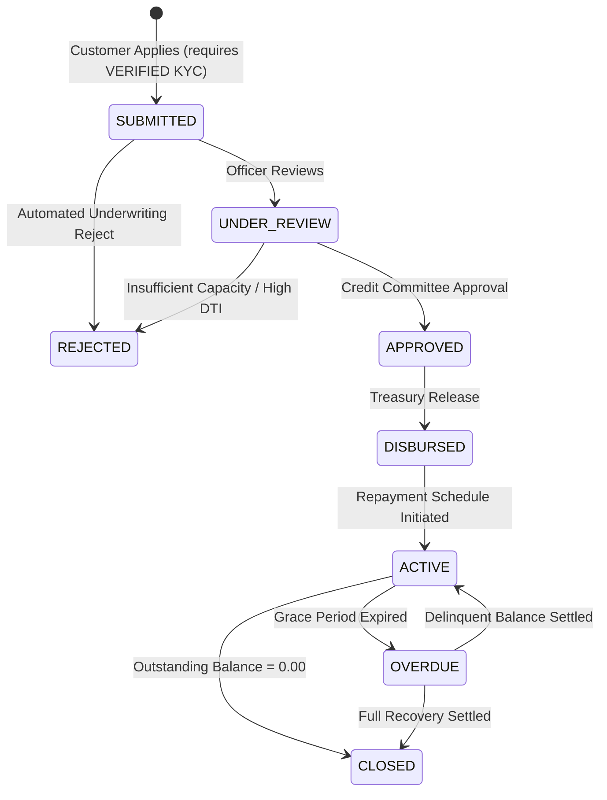

# CredenceOS Architecture Specification

CredenceOS is a modular-monolith lending & debt recovery management platform designed for Non-Banking Financial Companies (NBFCs) and digital credit providers.

---

## 1. System Topology

```
┌────────────────────────────────────────────────────────┐
│               Client (React 19 + Vite)                │
│  - Customer Portal (KYC + Amortization Calculator)     │
│  - Loan Officer Portal (Underwriting & Credit Review)   │
│  - Collection Agent Portal (Delinquency Tracking)      │
│  - Executive Admin (Reports & Audit Trail)             │
└──────────────────────────┬─────────────────────────────┘
                           │ HTTPS / REST (JWT)
┌──────────────────────────▼─────────────────────────────┐
│              Express.js Application Gateway             │
│  - Idempotency Interceptor (`Idempotency-Key`)         │
│  - RBAC Middleware (CUSTOMER, OFFICER, AGENT, ADMIN)    │
│  - Global Error Taxonomy & HTTP Normalizer             │
└───────┬──────────────────┬──────────────────┬──────────┘
        │                  │                  │
┌───────▼────────┐ ┌───────▼────────┐ ┌───────▼────────┐
│ Underwriting   │ │ Amortization   │ │ Compliance     │
│ Engine         │ │ Engine         │ │ Audit Service  │
│ - DTI Math     │ │ - Reducing EMI │ │ - Tamper-proof │
│ - Risk Factors │ │ - Cent Rounding│ │ - JSON State   │
└────────────────┘ └────────────────┘ └────────────────┘
                           │
┌──────────────────────────▼─────────────────────────────┐
│                 PostgreSQL Persistence Layer           │
│  - Users, Customers, Agents                            │
│  - KYC Records (Masked PAN, 4-digit Aadhaar)           │
│  - Loans & Amortization Repayment Schedules            │
│  - Payments (Atomic Ledger & Idempotency Store)        │
│  - Immutable AuditLogs                                 │
└────────────────────────────────────────────────────────┘
```

---

## 2. Finite State Machine (Loan Lifecycle)

Loan status cannot be altered arbitrarily; it strictly follows a deterministic state machine:



---

## 3. Financial Engines & Precision Math

### 3.1 Reducing-Balance Amortization Engine
Unlike flat rate systems, CredenceOS computes monthly compound reducing interest:

$$\text{EMI} = \frac{P \times r \times (1 + r)^n}{(1 + r)^n - 1}$$

- $P$: Principal amount
- $r$: Monthly interest rate ($\frac{\text{Annual Rate}}{12 \times 100}$)
- $n$: Tenure in months

**Penny-Reconciliation Guarantee**: The final installment dynamically reconciles principal components such that:
$$\sum_{i=1}^{n} \text{PrincipalComponent}_i \equiv P$$

### 3.2 Rule-Based Underwriting Engine
Calculates total monthly commitment including projected EMI:

$$\text{DTI} = \left(\frac{\text{Existing Debt} + \text{Projected EMI}}{\text{Monthly Income}}\right) \times 100$$

- **DTI $\le$ 35%**: Healthy (`LOW` Risk, Recommended for Approval)
- **35% < DTI $\le$ 50%**: Moderate (`MEDIUM` Risk, Referred to Manual Underwriting)
- **DTI > 50%**: Elevated (`HIGH` Risk, Rejection Recommended)

---

## 4. Payment Idempotency & Webhooks

- Every transaction request supports an `Idempotency-Key` HTTP header.
- Multiple submissions with identical idempotency keys return the cached response with `_idempotentReplay: true`, preventing double-debits.
- Mock webhook listener at `/api/payments/webhook` supports asynchronous payment reconciliation and state sync.

---

## 5. Security & Sensitive Data Compliance

1. **PAN & Aadhaar**: Full 12-digit Aadhaar numbers are never permanently stored; only the last 4 digits are retained (`aadhaarLastFour`). PAN numbers are displayed masked in responses (`ABCDE****F`).
2. **Audit Logging**: Every state change (KYC review, loan approval, disbursement, payment receipt) generates an append-only row in `AuditLog` capturing actor ID, IP address, previous state, and new state.
