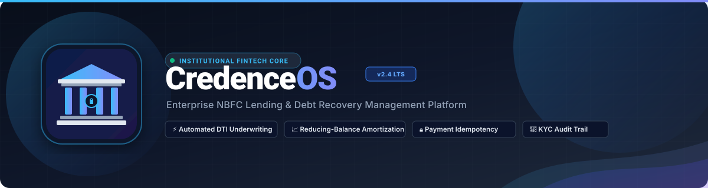
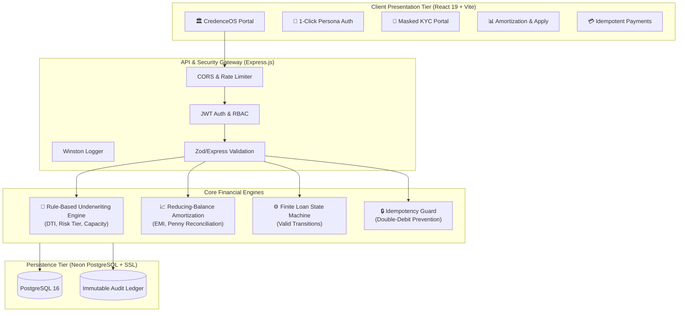

<!-- 🏛️ CREDENCEOS - ENTERPRISE NBFC LENDING MANAGEMENT PLATFORM -->

<p align="center">
  <a href="https://github.com/Aditya16703/CredenceOS-">
    
  </a>
</p>

<p align="center">
  <a href="https://credence-os.vercel.app">
    
  </a>
</p>

<p align="center">
  <a href="https://credence-os.vercel.app"></a>
  <a href="https://credenceos.onrender.com/health"></a>
  <a href="https://github.com/Aditya16703/CredenceOS-/actions/workflows/ci-cd.yml"></a>
</p>

<p align="center">
  
  
  
  
  
  
</p>

---

## 🌐 Live Production Deployments

Experience the live institutional lending platform across our production environments:

| Environment | Service | Live Link | Status |
| :--- | :--- | :--- | :--- |
| **Frontend Web App** | React 19 + Vite UI | [**credence-os.vercel.app**](https://credence-os.vercel.app) | 🟢 Live |
| **Backend REST API** | Express.js Core Engine | [**credenceos.onrender.com**](https://credenceos.onrender.com) | 🟢 Live |
| **Database** | Neon Cloud PostgreSQL (SSL) | `ep-red-star-b3l0toch-pooler (AWS ap-southeast-1)` | 🟢 Active |
| **Source Code** | GitHub Repository | [**Aditya16703/CredenceOS-**](https://github.com/Aditya16703/CredenceOS-) | 🟢 Public |

---

## ⚡ 1-Click Evaluator Personas (Live Testing)

Test the complete institutional lending and debt recovery lifecycle without manual registration:

| Persona | Role | Credentials | Capabilities |
| :--- | :--- | :--- | :--- |
| 👑 **Executive Admin** | `admin` | `admin@example.com` / `admin123` | Full credit portfolio analytics, loan approval/rejection, agent assignment, and audit ledger |
| 🛡️ **Recovery Officer** | `agent` | `agent@example.com` / `agent123` | Delinquent borrower worklists, debt recovery status tracking, and collections queue |
| 👤 **Retail Borrower** | `customer` | `customer@example.com` / `customer123` | Regulatory KYC onboarding, credit application, amortization schedule inspection, and payments |

> 💡 *Tip: On the [Live Portal](https://credence-os.vercel.app), click any of the **"⚡ 1-Click Evaluator Login"** buttons to auto-authenticate instantly.*

---

## 🎯 Executive Overview

**CredenceOS** is an institutional-grade Lending Management Platform built for Non-Banking Financial Companies (NBFCs), digital neo-banks, and credit originators. 

Unlike naive CRUD loan demos, CredenceOS incorporates core financial engineering primitives:
1. **Deterministic State Machine**: Strictly enforces regulatory state lifecycles (`DRAFT` → `SUBMITTED` → `UNDER_REVIEW` → `APPROVED` → `DISBURSED` → `ACTIVE` → `CLOSED` / `OVERDUE`).
2. **Explainable Underwriting Engine**: Automated multi-factor Debt-to-Income (DTI) computation and credit score risk tiering.
3. **Reducing-Balance Amortization Engine**: Precision monthly repayment calculation with penny/cent-level final installment reconciliation.
4. **Cryptographic Payment Idempotency**: Atomic database transactions protected by `Idempotency-Key` headers to eliminate double-debit anomalies.
5. **Event-Sourced Audit Ledger**: Append-only compliance log capturing actor, role, IP address, and JSON state deltas.

---

## 🏛️ System Architecture



---

## 🔬 Core Financial Calculations & Logic

### 1. Reducing-Balance Amortization Formula

The platform computes Equated Monthly Installments (EMI) using the true reducing-balance actuarial formula:

$$\text{EMI} = P \times r \times \frac{(1+r)^n}{(1+r)^n - 1}$$

Where:
* $P$ = Principal Loan Amount
* $r$ = Periodic Monthly Interest Rate $\left(\frac{\text{Annual Rate}}{12 \times 100}\right)$
* $n$ = Loan Tenure in Months

> **Reconciliation Guarantee**: The final installment automatically absorbs fractional rounding residues so that:
> $$\text{Closing Principal}_{n} \equiv 0.00$$

### 2. Explainable Underwriting Rule Engine

The underwriting decision engine evaluates credit eligibility before loan creation:

$$\text{DTI Ratio} = \frac{\text{Existing Monthly Debts} + \text{Proposed EMI}}{\text{Monthly Income}} \times 100\%$$

| DTI Threshold | Credit Score | Risk Tier | Decision Rule |
| :---: | :---: | :---: | :---: |
| $\le 35\%$ | $\ge 750$ | **LOW RISK** | ✅ Auto-Approved (Prime rate) |
| $36\% - 50\%$ | $650 - 749$ | **MODERATE RISK** | 🔍 Referred for Underwriter Review |
| $> 50\%$ | $< 650$ | **HIGH RISK** | ⚠️ Flagged for Collateral / Guarantor |
| $> 70\%$ | Any | **UNACCEPTABLE** | ❌ Hard Rejection |

---

## 💻 Tech Stack & Infrastructure

```
CredenceOS
├── 🎨 Frontend          React 19, Vite, Plus Jakarta Sans, CSS Modules, Glassmorphism
├── ⚙️ Backend           Node.js 20+, Express.js, Sequelize ORM, Winston, Crypto
├── 🗄️ Database          PostgreSQL 16 (Neon Serverless with SSL)
├── 🐳 Containers        Docker, Docker Compose, Multi-stage Nginx Build
├── 🚀 CI/CD Pipeline    GitHub Actions (Automated Unit Tests & Vite Build)
└── ☁️ Hosting           Render (API Service) + Vercel (Production UI)
```

---

## 🛠️ Local Development & Quickstart

### Prerequisites
* **Node.js**: v18.0.0 or higher
* **PostgreSQL**: Local installation or cloud connection string
* **Docker & Docker Compose** (Optional for containerized run)

### Method 1: Bare Metal Development

```bash
# 1. Clone repository
git clone https://github.com/Aditya16703/CredenceOS-.git
cd CredenceOS-

# 2. Configure Backend Environment
cd backend
npm install
cp .env.example .env   # Configure DATABASE_URL and JWT_SECRET
npm run dev

# 3. Configure Frontend Environment (in a new terminal)
cd ../frontend
npm install
npm run dev
```

* Frontend running at: `http://localhost:5173`
* Backend API running at: `http://localhost:5000`

### Method 2: Multi-Container Docker Compose

```bash
# Build and run backend + frontend + postgres containers
docker-compose up --build
```

---

## 🧪 Automated Test Suite

CredenceOS includes comprehensive unit tests verifying the mathematical integrity of the financial calculation engines:

```bash
cd backend
npm test
```

```text
TAP version 13
ok 1 - Amortization Engine - calculateEMI returns accurate financial numbers
ok 2 - Amortization Engine - 0% interest edge case
ok 3 - Amortization Engine - Final installment reconciles closing principal to exactly 0.00
ok 4 - Underwriting Engine - Low risk profile approved with healthy DTI
ok 5 - Underwriting Engine - High risk profile flagged when DTI is extreme
ok 6 - Loan State Machine - Valid and invalid transitions
ok 7 - KYC Compliance - PAN masking protects sensitive identity
ok 8 - Payment Idempotency - Key caching simulation
1..8
# tests 8 | pass 8 | fail 0
```

---

## 📁 Repository Structure

```
CredenceOS-
├── .github/workflows/         # Automated GitHub Actions CI/CD pipeline
├── backend/
│   ├── src/
│   │   ├── controllers/      # auth, loan, payment, kyc, audit controllers
│   │   ├── models/           # Sequelize ORM schema definitions & relationships
│   │   ├── routes/           # RESTful API route definitions & middleware
│   │   ├── services/         # Amortization, underwriting & audit engine logic
│   │   └── server.js         # Express server entry point & error handlers
│   └── tests/                # Mathematical calculation & state machine tests
├── frontend/
│   ├── src/
│   │   ├── pages/            # Home, Dashboard, Loans, Payments, KYC, Reports
│   │   ├── utils/            # api.js client, session management, token handlers
│   │   ├── index.css         # Institutional design system tokens & glassmorphism
│   │   └── App.jsx           # Authenticated root router
│   └── vercel.json           # Single-page application routing rules
├── docker-compose.yml         # Full-stack multi-container specification
├── render.yaml                # Render Blueprint infrastructure deployment
└── README.md                  # Institutional documentation
```

---

## 📜 Compliance & Security Architecture

* **PII Redaction**: Identity documents (Permanent Account Number - PAN, Aadhaar) are stored in compliant masked representations (`XXXXXX1234`).
* **Stateless Security**: Authentication is managed via salted bcrypt hashes (10 rounds) and signed JSON Web Tokens (JWT).
* **Double-Debit Mitigation**: Payment endpoints require a cryptographic `Idempotency-Key` preventing concurrent submission race conditions.
* **Audit Trail Immutability**: All credit decisions and status movements append to a non-destructive audit log.

---

## 👨‍💻 Author & Contact

**Aditya Singh Chauhan**  
*Full Stack Financial Software Engineer*

[](https://github.com/Aditya16703)
[](https://linkedin.com)
[](mailto:ac3413452@gmail.com)

---

## 📄 License

This project is licensed under the **MIT License** — see the [LICENSE](LICENSE) file for complete details.

<p align="center">
  
</p>
